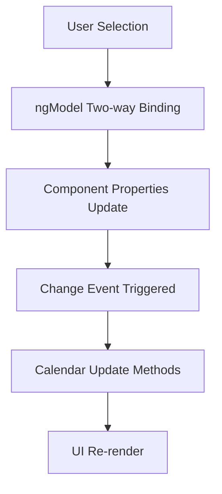

# Báo Cáo Phân Tích Angular Forms trong Dự Án

**Người thực hiện:** Cascade AI Assistant  
**Ngày thực hiện:** 10/09/2025  
**Người giám sát:** Nguyen Thanh Hung  

## Tóm Tắt Báo Cáo

Dự án Angular Calendar sử dụng Template-driven Forms thông qua FormsModule để quản lý các form controls trong calendar component. Ứng dụng sử dụng ngModel directive để thực hiện two-way data binding cho các select elements.

## Nội Dung Báo Cáo

### 1. Cấu Trúc Dự Án Angular

Dự án được tổ chức theo cấu trúc Angular standalone components:

```
angular-calendar/
├── src/
│   ├── app/
│   │   ├── calendar/
│   │   │   ├── calendar.component.ts
│   │   │   ├── calendar.component.html
│   │   │   ├── calendar.component.css
│   │   │   └── calendar.component.spec.ts
│   │   ├── app.component.ts
│   │   ├── app.config.ts
│   │   └── app.routes.ts
│   └── main.ts
└── package.json
```

### 2. Dependencies và Modules

#### Package.json Dependencies
```json
"@angular/forms": "^19.2.0"
```

#### Component Imports
Trong `calendar.component.ts`:
```typescript
import { FormsModule } from '@angular/forms';

@Component({
  selector: 'app-calendar',
  standalone: true,
  imports: [CommonModule, FormsModule],
  templateUrl: './calendar.component.html',
  styleUrls: ['./calendar.component.css']
})
```

### 3. Cách Sử Dụng Angular Forms

#### 3.1 Template-driven Forms Implementation

Dự án sử dụng **Template-driven Forms** thông qua `FormsModule`. Cách triển khai:

**File: calendar.component.ts**
```typescript
export class CalendarComponent implements OnInit {
  selectedYear: number;
  selectedMonth: number;
  selectedWeek: number = 1;
  
  years: number[] = [];
  months: { value: number; name: string }[] = [];
  weeksInMonth: number[] = [];
  
  constructor() {
    this.selectedYear = this.currentDate.getFullYear();
    this.selectedMonth = this.currentDate.getMonth() + 1;
  }
}
```

#### 3.2 Two-way Data Binding với ngModel

**File: calendar.component.html**

1. **Year Selector:**
```html
<select id="year-select" [(ngModel)]="selectedYear" (change)="onDateChange()"
        class="p-2 border border-gray-300 rounded-md shadow-sm focus:ring-indigo-500 focus:border-indigo-500">
  <option *ngFor="let year of years" [value]="year">{{ year }}</option>
</select>
```

2. **Month Selector:**
```html
<select id="month-select" [(ngModel)]="selectedMonth" (change)="onDateChange()"
        class="p-2 border border-gray-300 rounded-md shadow-sm focus:ring-indigo-500 focus:border-indigo-500">
  <option *ngFor="let month of months" [value]="month.value">{{ month.name }}</option>
</select>
```

3. **Week Selector:**
```html
<select id="week-select" [(ngModel)]="selectedWeek" (change)="onWeekChange()"
        class="p-2 border border-gray-300 rounded-md shadow-sm focus:ring-indigo-500 focus:border-indigo-500">
  <option *ngFor="let week of weeksInMonth" [value]="week">Week {{ week }}</option>
</select>
```

#### 3.3 Event Handling

**Change Event Handlers:**
```typescript
onDateChange(): void {
  this.updateCalendar();
}

onWeekChange(): void {
  this.generateWeekDays();
}
```

### 4. Form Controls Analysis

| Control | Type | Binding | Event Handler | Purpose |
|---------|------|---------|---------------|---------|
| year-select | select | `[(ngModel)]="selectedYear"` | `onDateChange()` | Chọn năm hiển thị |
| month-select | select | `[(ngModel)]="selectedMonth"` | `onDateChange()` | Chọn tháng hiển thị |
| week-select | select | `[(ngModel)]="selectedWeek"` | `onWeekChange()` | Chọn tuần hiển thị |

### 5. Data Flow và State Management



**Data Flow Process:**
1. User thay đổi giá trị trong select element
2. `ngModel` tự động cập nhật component property
3. `(change)` event được trigger
4. Event handler được gọi (`onDateChange()` hoặc `onWeekChange()`)
5. Calendar data được cập nhật
6. UI được re-render với dữ liệu mới

### 6. Testing Configuration

**File: calendar.component.spec.ts**
```typescript
import { FormsModule } from '@angular/forms';

beforeEach(async () => {
  await TestBed.configureTestingModule({
    imports: [CalendarComponent, FormsModule]
  }).compileComponents();
});
```

### 7. Ưu Điểm và Nhược Điểm

#### Ưu Điểm:
- **Đơn giản:** Template-driven forms dễ hiểu và triển khai
- **Two-way binding:** Tự động đồng bộ dữ liệu giữa template và component
- **Minimal code:** Ít code boilerplate cần thiết
- **Suitable for simple forms:** Phù hợp với form đơn giản như calendar controls

#### Nhược Điểm:
- **Limited validation:** Khó thực hiện complex validation
- **No reactive programming:** Không tận dụng được reactive programming patterns
- **Testing complexity:** Khó test hơn so với reactive forms
- **Scalability:** Không phù hợp cho forms phức tạp

### 8. Code Examples Chi Tiết

#### 8.1 Component Property Initialization
```typescript
// File: calendar.component.ts - lines 24-29
constructor() {
  this.selectedYear = this.currentDate.getFullYear();
  this.selectedMonth = this.currentDate.getMonth() + 1;
  this.populateYears();
  this.populateMonths();
}
```

#### 8.2 Dynamic Options Generation
```typescript
// File: calendar.component.ts - lines 35-47
populateYears(): void {
  const currentYear = new Date().getFullYear();
  for (let i = currentYear - 10; i <= currentYear + 10; i++) {
    this.years.push(i);
  }
}

populateMonths(): void {
  const monthNames = ["January", "February", "March", "April", "May", "June",
    "July", "August", "September", "October", "November", "December"
  ];
  this.months = Array.from({ length: 12 }, (_, i) => ({ value: i + 1, name: monthNames[i] }));
}
```

#### 8.3 Calendar Update Logic
```typescript
// File: calendar.component.ts - lines 49-61
updateCalendar(): void {
  this.populateWeeksInMonth();
  const today = new Date();
  const currentWeekNumber = this.getWeekNumber(today);

  if (this.selectedYear === today.getFullYear() && this.selectedMonth === today.getMonth() + 1) {
      this.selectedWeek = currentWeekNumber;
  } else if (!this.weeksInMonth.includes(this.selectedWeek)) {
      this.selectedWeek = this.weeksInMonth[0] || 1;
  }

  this.generateWeekDays();
}
```

## Kết Luận

Dự án Angular Calendar sử dụng Template-driven Forms một cách hiệu quả cho việc quản lý các form controls đơn giản. Việc sử dụng `FormsModule` và `ngModel` directive cho phép thực hiện two-way data binding một cách dễ dàng cho các select elements (year, month, week selectors).

**Các điểm chính:**
- Sử dụng Template-driven Forms thông qua FormsModule
- Triển khai ngModel directive cho three-way data binding
- Event handling thông qua (change) events
- Phù hợp với yêu cầu đơn giản của calendar component
- Code structure rõ ràng và dễ maintain

**Khuyến nghị:**
- Tiếp tục sử dụng Template-driven Forms cho các form controls đơn giản
- Cân nhắc chuyển sang Reactive Forms nếu cần thêm validation phức tạp
- Thêm form validation nếu cần thiết cho user experience tốt hơn
